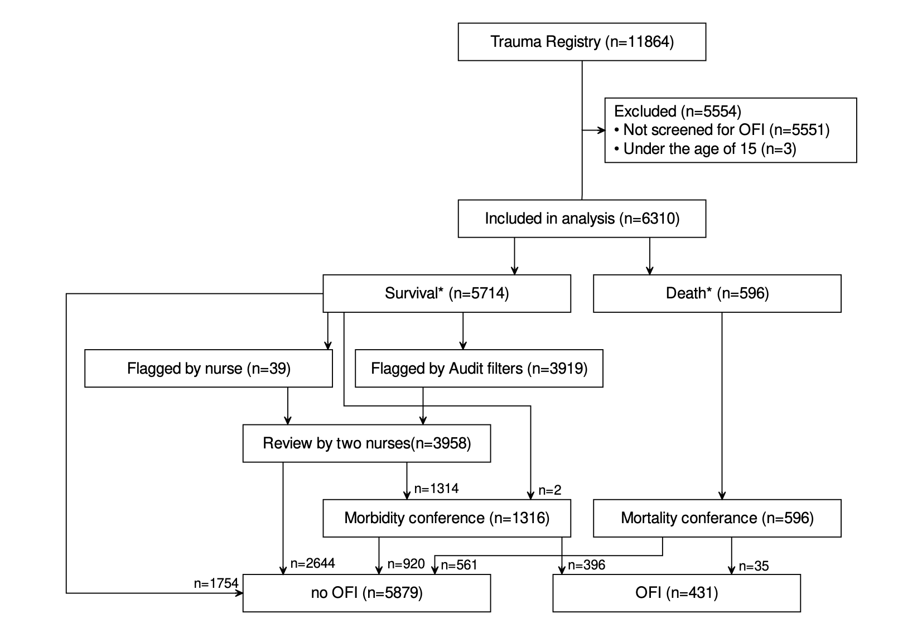

```{r setup, include=FALSE}
knitr::opts_chunk$set(echo = TRUE)
```

```{=html}
<!-- This is an R Markdown document. Markdown is a simple formatting
syntax for authoring HTML, PDF, and MS Word documents. For more
details on using R Markdown see http://rmarkdown.rstudio.com -->
```
```{=html}
<!-- This is a comment and will not be present in the compiled
document. Try "knitting" this document by clicking the knit button up
to the left, or by running `rmarkdown::render("manuscript.Rmd")` in
the console and you should only see headings -->
```
```{=html}
<!-- Structure and most comments are from the Strengthening the
reporting of observational studies in epidemiology (STROBE) statement,
see https://www.strobe-statement.org/. For more explanations see the
paper Strengthening the Reporting of Observational Studies in
Epidemiology (STROBE):explanation and elaboration.  -->
```
```{=html}
<!-- Indicate the study’s design with a commonly used term in the
title, for example: "Associations between resuscitation interventions
and opportunities for improvement in adult trauma patients: A cohort
study" -->
```
# Abstract

```{=html}
<!-- Provide in the abstract an informative and balanced summary of
what was done and what was found. Not more than 300 words. -->
```
## Background

## Methods

## Results

## Conclusion

# Introduction

Trauma, defined as the clinical entity composed of the combination of physical injury and the body's associated responses [@gerdin_risk_2015] is a significant public health concern worldwide, accounting for a substantial portion of morbidity and mortality rates, being the cause of 4.3 million fatalities each year [@injuries2020]. It is the leading cause of death for people aged 18-39 [@Peng2023-gd]. Trauma, and care of patients with traumatic injuries, have long been a significant target point for healthcare improvement programs [@WHO2009]. Multidisciplinary morbidity and mortality conferences form a cornerstone of initiatives dedicated to enhancing the quality of trauma care and consequently, improving patient outcomes [@Santana2014].

#### Opportunities for improvement

Audit filters, a system used to flag abnormal clinical parameters as possible opportunities for improvement (OFI), are applied to determine possible events in patient care that are associated with unfavourable outcomes. The occurrence of such an event triggers a review process, which in turn leads to a meeting of the multidisciplinary review board during mortality and morbidity conferences. An OFI is a consensus decision made during a conference and includes proposals for corrective actions, and when appropriate implementation of corrective measures to address systematic errors and feedback to individual practitioners [@McDermott_1994]. At mortality and morbidity conferences, representatives from different professions and specialities adjacent to trauma care come together to discuss care provided to a specific patient and compare it to care given under optimal conditions. The findings of such a conference are whether OFI can be found in any given case. Examples of OFI may include lack of resources and management errors [@Lazzara2020]. The use of audit filters has its drawbacks, being associated with high rates of false positives [@Sanddal2011; @Ghorbani2018; @Evans2009].

#### Artificial intelligence

In recent years, artificial intelligence (AI) has made great advances, making it a topic of interest in regard to healthcare applications. Research on AI implementation for clinical use has become commonplace and has already been tried in some clinical contexts, such as aiding in the diagnosis of pathologies through analysis of radiological images [@Cellina2022-qp] as well as epidemiological prediction of disease patterns, an example being during the COVID-19 pandemic [@Chen2020-ue].

With AI, computing is used to mimic human intelligence, characterized by its ability to learn and reason. Through predictive modelling, AI can be used as a tool to problem solve. Computation has the advantage of analysing great quantities of data in a short time, giving it an edge [@Cellina2022-qp]. The primary way to achieve AI is through machine learning (ML), in which statistical modelling is applied to a computer system where it learns from previous data, and thus circumvents human programming. The approach with ML has increasingly been utilized to analyse data and can be used to gain further information from data, such as making predictions of outcomes[@MLJung]. The ability to improve modelling algorithms with the use of ML thus has the ability to improve said algorithms autonomously, which in turn opens the door for a wide array of applications in healthcare. One such application is to develop more accurate prediction models that can further quality improvement programs.

### AI in trauma care

<!-- Expand on this section to introduce AI/ML in trauma care more generally, and then focus on the application of ML to select patients for M&M -->

To enhance the precision of the selection process for mortality and morbidity conferences, there have been efforts to introduce trauma mortality prediction models. Nevertheless, the performance of these models has been unsatisfactory, being poor predictors for OFI [@Ghorbani2018; @Heim_2016]. This is likely because these models were originally developed with a focus on predicting mortality rather than morbidity or instances of care failures within the realm of trauma care.

Machine learning-based prediction models have been found to outperform conventional methods to predict opportunities for improvement [@Attergrim2023].

#### Trauma care in different patient cohorts

<!-- Similar performance across different subgroups is also important from a fairness perspective, meaning that if the model performs worse among women, then we risk providing lower quality care to women, because we might miss important OFI -->

Men make up a disproportionally large group compared to women when it comes to trauma. Each year, almost twice as many men die due to traumatic injury when compared to women, with the distribution of different types of injury varying by demographic and region [@WHO2014]. Females have been shown to have a higher survival following trauma in higher income countries, whereas those in lower income countries show no difference compared to men. Differences in cell-mediated immune response following haemorrhage, differences in post-traumatic cytokine levels, and potential protective effects of oestrogen have been proposed to be the cause of the disparity between these groups [@Pendleton2022]. It is important, that due to the differences between men and women, that the model for prediction has similar performance in these subgroups. Furthermore, it is important to establish if trained models perform equally well across different cohorts within the wider span of trauma, such as patients with traumatic brain injury (TBI) and without.

## Aim

To assess the difference in performance of prediction models for opportunities for improvement in trauma care among women compared to men and across clinical trauma cohorts.

# Methods

## Methods

#### Study setting and participants

We conducted a registry-based study, encompassing all trauma patients enlisted in both the Karolinska University Hospital trauma registry and the trauma care quality database spanning from 2012 to 2022. The Karolinska University Hospital in Solna is equivalent to a level 1 trauma centre and manages approximately 1,500 acute trauma patients each year [@Ghorbani2018; @swetrau]. The trauma registry comprises all patients admitted to the hospital with trauma team activation, irrespective of their Injury Severity Score (ISS), as well as patients with an ISS exceeding 9. Included in the registry is data on vital signs, injuries, interventions, times, and patient demographics.

The trauma registry encompasses approximately 12,000 patients treated from 2012 to 2022. The trauma care quality database in turn is a subset of the trauma registry, including about 6000 patients selected for review in the years 2013-2022.

<!-- Consider citing Hussein's paper in your definition of OFI: "The outcome was the presence of OFI, as decided by the morbidity and mortality conference. An OFI is any failure of care including, but not limited to, any potentially preventable or preventable death, delay in treatment, clinical judgment error, missed diagnosis and technical error as decided by the mortality and morbidity conference. The study outcome is binary with the levels “Yes - At least one OFI identified” and “No - No OFI identified”."

https://sjtrem.biomedcentral.com/articles/10.1186/s13049-023-01157-y

-->

OFI are identified through meetings of the multidisciplinary review board during mortality and morbidity conferences. An OFI is a consensus decision made during a conference and includes proposals for corrective actions. These in turn are recorded in the trauma care quality database. The trauma care quality database also includes data relevant to mortality and morbidity conferences, such as audit filters. The mortality and morbidity conferences at Karolinska University Hospital involve professionals from various specialities within trauma care, including surgery, neurosurgery, orthopaedics, anaesthesia, intensive care, nursing, and radiology. Cases considered for a conference go through multiple rounds of review. Mortality leads to direct inclusion.

Between 2013 and 2017, non-fatal poor outcomes were identified through reviews conducted by a specialized trauma nurse to identify potential OFI. Starting in 2017, the process was formalized, involving an initial review by a specialized trauma nurse along with the application of audit filters. All cases that were flagged either during the initial nurse review or by the audit filters underwent a secondary review conducted by two specialized nurses. If the second review identified potential areas for improvement (OFI), the case was marked for discussion in a multidisciplinary conference.

 Figure illustrating process of mortality and morbidity conference at Karolinska University Hospital.

#### Eligibility criteria

All patients reviewed for possible OFI between the years 2013 and 2022 are included in the study, with the exception of patients under the age of 15 due to differing clinical pathways in this subgroup.

#### Outcome

The outcome of this study will be defined as "Yes, there is a significant difference in models prediction of OFI in different cohorts" or "No, there is no significant difference in models prediction of OFI in different cohorts." Data for this will be extracted from the trauma care quality database and run through a number of machine learning models, that have been trained previous to this study.

#### Predictors

All variables from the trauma registry are considered potential predictors in our analysis and have been incorporated into the models. <!-- Note that the models are already developed. So you should write about what have already been done,i.e. these variables are already incorporated into the
models-->These variables include information spanning the pre-hospital, initial care, and subsequent in-hospital phases, which include initial vital signs, timing, and types of procedures and interventions, duration and level of care, injury details, mechanisms of injury, injury types, and standard demographic information. This array of predictors comprises both continuous and categorical variables, ultimately resulting in the final models utilizing a total of 45 predictors.

All available data was used, with a sample size of 6310 patients. This is due to previously developed prediction models being based on all available data, as well as including all 45 predictors regardless of the learner used for the development of the model.

The models have been developed and trained on the data set previous to this study [@Attergrim2023]. Eight models are included, all being developed using the Tidymodels framework [@tidymodels]. These include logistic regression (LR), random forest (RF), decision tree (DT), support vector machine with a radial basis kernel (SVM), XGBoost, LightGBM, CatBoost, and k-nearest neighbor (k-NN).

#### Cohorts

The different models' performance were assessed in the following cohorts:

1.  Isolated severe TBI: Injury isolated to the area of the brain with AIS \> 2 and:

    a.  pre-hospital GCS of \< 9

        or

    b.  Pre- or in-hospital intubation.

2.  Blunt multi-system trauma without TBI: Blunt trauma with AIS \> 2 and injuries in at least two of the following AIS body regions: head, face, neck, thorax, abdomen, spine, or upper and lower extremities and no injury to the brain with AIS \>2 and:

    a.  pre-hospital GCS of \< 9

        or

    b.  Pre- or in-hospital intubation.

3.  Blunt multi-system trauma with TBI: Blunt trauma with AIS \> 2 and injuries in at least two of the following AIS body regions: head, face, neck, thorax, abdomen, spine, or upper and lower extremities and with injury to the brain with AIS \>2 and:

    a.  pre-hospital GCS of \< 9

        or

    b.  Pre- or in-hospital intubation

Along with these cohorts, all machine learning models were assessed regarding differences between male and female sex in their prediction of OFI.

#### Statistical analysis

R was employed for all statistical analysis. For the analysis, a 95% confidence level and 5% significance level were employed. For each model, the performance was assessed in the predefined cohorts and compared to other models performance in regards to sensitivity and specificity.

## Study design

<!-- Present key elements of study design -->

## Setting

```{=html}
<!-- Describe the setting, locations, and relevant dates, including
periods of recruitment, exposure, follow-up, and data collection -->
```
## Participants

```{=html}
<!-- Cohort study: Give the eligibility criteria, and the sources and
methods of selection of participants. Describe methods of
follow-up. For matched studies, give matching criteria and number of
exposed and unexposed -->
```
```{=html}
<!-- Case-control study: Give the eligibility criteria, and the
sources and + methods of case ascertainment and control
selection. Give the rationale for the choice of cases and
controls. For matched studies, give matching criteria and the number
of controls per case -->
```
```{=html}
<!-- Cross-sectional study: Give the eligibility criteria, and the
sources and methods of selection of participants -->
```
## Variables and data sources/measurements

```{=html}
<!-- Clearly define all outcomes, exposures, predictors, potential
confounders, and effect modifiers. Give diagnostic criteria, if
applicable. For each variable of interest, give sources of data and
details of methods of assessment (measurement). Describe comparability
of assessment methods if there is more than one group -->
```
## Bias

<!-- Describe any efforts to address potential sources of bias -->

## Study size

<!-- Explain how the study size was arrived at -->

## Quantitative variables

```{=html}
<!-- Explain how quantitative variables were handled in the
analyses. If applicable, describe which groupings were chosen and why
-->
```
## Statistical methods

```{=html}
<!-- 

(a) Describe all statistical methods, including those used to control
for confounding

(b) Describe any methods used to examine subgroups and interactions

(c) Explain how missing data were addressed 

(d) 

Cohort study: If applicable, explain how loss to follow-up was addressed 

Case-control study:If applicable, explain how matching of cases and
controls was addressed

Cross-sectional study: If applicable, describe analytical methods
taking account of sampling strategy

(e) Describe any sensitivity analyses
-->
```
# Results

### Participants

The Karolinska trauma registry contains 11864 patients, of which 6310 are reviewed for OFI, either through selection by individual review or application of audit filters, as well as an unknown process (n=2). Through this, 1316 patients were selected for the morbidity conference, and 596 patients for the mortality conference. Out of 596 deaths reviewed, 35 were found to be preventable (n=4) or possibly preventable (n=31). The remaining 561 patients were thus rendered non-preventable without OFI. Further, 1316 alive patients were included during a morbidity conference, of which 396 (7%) were identified as cases with OFI.

Among the 6310 patients, the majority (n=4383) (69%) were male, and the mean age was 45 (SD 21). Overall, the mortality in the group was 599 (9%).

In the group identified as OFI (n = 431), the mean age was somewhat higher than in the group without OFI (n=5879) (mean 48 vs 45 years). For OFI patients, they were most commonly treated at an intensive care unit (35%), whereas patients without OFI were most commonly treated at a general ward (37%). ISS was also higher for OFI patients (mean: 19, SD:11 vs mean: 12, SD:13). In-hospital intubation occurred in 74 (17%) OFI patients, compared to non-OFI (n=460, 8%). They had a longer time till definitive treatment (median: 143 vs 99 minutes from hospital arrival). Definitive treatments differed, with OFI patients receiving more interventions, particularly radiological (7% vs 1%).

The variables most frequently missing data were "Time to normal BE" (n=6107), "Pre-hospital intubation type" (N=5812), and "Emergency department intubation type" (n=5749).

### Descriptive data

### Outcome data

### Main result

### Other analysis

```{=html}
<!-- 

Participants
------------

(a) Report numbers of individuals at each stage of study—eg numbers
potentially eligible, examined for eligibility, confirmed eligible,
included in the study, completing follow-up, and analysed

(b) Give reasons for non-participation at each stage

(c) Consider use of a flow diagram

Descriptive data
----------------

(a) Give characteristics of study participants (eg demographic,
clinical, social) and information on exposures and potential
confounders

(b) Indicate number of participants with missing data for each
variable of interest

(c) Cohort study — Summarise follow-up time (eg, average and total
amount)

Outcome data
------------

Cohort study — Report numbers of outcome events or summary measures
over time

Case-control study — Report numbers in each exposure category, or
summary measures of exposure

Cross-sectional study — Report numbers of outcome events or summary
measures

Main results
------------

(a) Give unadjusted estimates and, if applicable, confounder-adjusted
estimates and their precision (eg, 95% confidence interval). Make
clear which confounders were adjusted for and why they were included

(b) Report category boundaries when continuous variables were
categorized

(c) If relevant, consider translating estimates of relative risk into
absolute risk for a meaningful time period

Other analyses 
--------------

Report other analyses done—eg analyses of subgroups and interactions,
and sensitivity analyses 
-->
```
You can include code in this document like this:

```{r main, echo=FALSE}
source("main.R") ## This "imports" the main script file of your project and run any code in it
```

You can also embed plots:

```{r plot, echo=FALSE}
plot(pressure)
```

You can also mix text and code, so called inline code, like this: `r 2+5`.

# Discussion

```{=html}
<!--

Key results
-----------
Summarise key results with reference to study objectives

Limitations
-----------

Discuss limitations of the study, taking into account sources of
potential bias or imprecision.  Discuss both direction and magnitude
of any potential bias

Interpretation
--------------

Give a cautious overall interpretation of results considering
objectives, limitations, multiplicity of analyses, results from
similar studies, and other relevant evidence

Generalisability
----------------

Discuss the generalisability (external validity) of the study results

-->
```
# Conclusion

<!-- Give a short conclusion, corresponding to the aim -->

# References

<!-- Do not edit by hand, references will be inserted and formatted automatically once you knit this document -->
