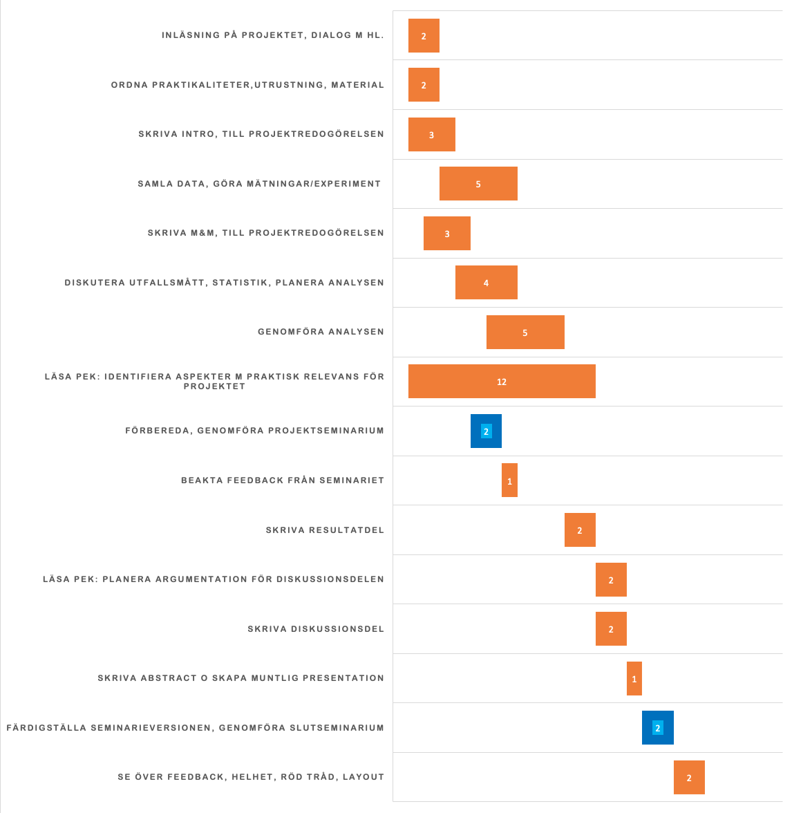

```{r setup, include=FALSE}
knitr::opts_chunk$set(echo = TRUE)
```

```{=html}
<!-- The project plan should be 3-4 pages long and written in
Rmarkdown (like this document). Remove all comments in italic when you 
use this document as a template for your own project plan. -->
```
```{=html}
<!-- This is an R Markdown document. Markdown is a simple formatting
syntax for authoring HTML, PDF, and MS Word documents. For more
details on using R Markdown see http://rmarkdown.rstudio.com -->
```
```{=html}
<!-- This is a comment and will not be present in the compiled
document. Try "knitting" this document by clicking the knit button up
to the left, or by running `rmarkdown::render("manuscript.Rmd")` in
the console and you should only see headings -->
```
## Introduction

Trauma, defined as the clinical entity composed of the combination of physical injury and the body's associated responses [@gerdin_risk_2015] is a significant public health concern worldwide, accounting for a substantial portion of morbidity and mortality rates, being the cause of 4.3 million fatalities each year [@injuries2020]. Trauma, and care of patients with traumatic injuries, has long been a significant target point for healthcare improvement programs [@WHO2009]. Multidisciplinary morbidity and mortality conferences form the cornerstone of initiatives dedicated to enhancing the quality of trauma care and consequently, improving patient outcomes [@Santana2014].

Audit filters, a system used to flag abnormal clinical parameters as possible opportunities for improvement (OFI), are applied to determine possible events in patient care that are associated with unfavourable outcomes. The occurrence of such an event triggers a review process, which in turn leads to a multidisciplinary conference and when appropriate to implementation of corrective measures to address systematic errors and feedback to individual practitioners [@McDermott_1994]. The use of audit filters has its drawbacks, being associated with high rates of false positives [@Sanddal2011; @Ghorbani2018; @Evans2009].

At mortality and morbidity conferences, representatives from different professions and specialties adjacent to trauma care come together to discuss care provided to a specific patient and compare it to care given under optimal conditions. The findings of such a conference are whether OFI can be found in any given case. Examples of OFI may include lack of resources and management errors [@Lazzara2020].

To enhance the precision of the selection process, there have been efforts to introduce trauma mortality prediction models. Nevertheless, the performance of these models has been unsatisfactory, being poor predictors for OFI [@Ghorbani2018; @Heim_2016]. This is likely because these models were originally developed with a focus on predicting mortality rather than morbidity or instances of care failures within the realm of trauma care. Machine learning-based prediction models have been found to outperform conventional methods to predict opportunities for improvement [@Attergrim2023].

Men make up a disproportionally large group compared to women when it comes to trauma. Each year, almost twice as many men die due to traumatic injury when compared to women, with the distribution of different types of injury varying by demographic and region [@WHO2014]. Females have been shown to have a higher survival following trauma in higher income countries, whereas those in lower income countries show no difference compared to men. Differences in cell-mediated immune response following haemorrhage, differences in post-traumatic cytokine levels, and potential protective effects of oestrogen have been proposed to be the cause of the disparity between these groups [@Pendleton2022]. It is important, that due to the differences between men and women, that the model for prediction has similar performance in these subgroups. Furthermore, it is important to establish if trained models perform equally well across different cohorts within the wider span of trauma, such as patients with traumatic brain injury (TBI) and without.

## Aim

To assess the difference in performance of prediction models for opportunities for improvement in trauma care among women compared to men and across clinical trauma cohorts.

## Methods

#### Study setting and participants

We will conduct a registry-based study, encompassing all trauma patients enlisted in both the Karolinska University Hospital trauma registry and the trauma care quality database spanning from 2012 to 2022. The Karolinska University Hospital in Solna is equivalent to a level 1 trauma centre and manages approximately 1,500 acute trauma patients each year [@Ghorbani2018; @swetrau]. The trauma registry comprises all patients admitted to the hospital with trauma team activation, irrespective of their Injury Severity Score (ISS), as well as patients with an ISS exceeding 9. Included in the registry is data on vital signs, injuries, interventions, times, and patient demographics.

The trauma registry encompasses approximately 12,000 patients treated from 2012 to 2022. The trauma care quality database in turn is a subset of the trauma registry, including about 6000 patients selected for review in the years 2013-2022.

OFI are identified through meetings of the multidisciplinary review board during mortality and morbidity conferences. An OFI is a consensus decision made during a conference and includes proposals for corrective actions. These in turn are recorded in the trauma care quality database. The trauma care quality database also includes data relevant to mortality and morbidity conferences, such as audit filters. The mortality and morbidity conferences at Karolinska University Hospital involve professionals from various specialties within trauma care, including surgery, neurosurgery, orthopedics, anesthesia, intensive care, nursing, and radiology. Cases considered for a conference go through multiple rounds of review. Mortality leads to direct inclusion. Between 2013 and 2017, non-fatal poor outcomes were identified through reviews conducted by a specialized trauma nurse to identify potential OFI. Starting in 2017, the process was formalized, involving an initial review by a specialized trauma nurse along with the application of audit filters. All cases that were flagged either during the initial nurse review or by the audit filters underwent a secondary review conducted by two specialized nurses. If the second review identified potential areas for improvement (OFI), the case was marked for discussion in a multidisciplinary conference.


Figure illustrating process of mortality and morbidity conference at Karolinska University Hospital.

#### Eligibility criteria

All patients reviewed for possible OFI between the years 2013 and 2022 are included in the study, with the exception of patients under the age of 15 due to differing clinical pathways in this subgroup.

#### Outcome

The outcome of this study will be defined as "Yes, there is a significant difference in models prediction of OFI in different cohorts" or "No, there is no significant difference in models prediction of OFI in different cohorts." Data for this will be extracted from the trauma care quality database and run through different previously trained machine learning models.

#### Predictors

All variables from the trauma registry will be considered as potential predictors in our analysis and have already been incorporated into the models.<!-- Note that the models are already developed. So you should write about what have already been done,i.e. these variables are already incorporated into the
models-->These variables include information spanning the pre-hospital, initial care, and subsequent in-hospital phases, which include initial vital signs, timing, and types of procedures and interventions, duration and level of care, injury details, mechanisms of injury, injury types, and standard demographic information. This array of predictors comprises both continuous and categorical variables, ultimately resulting in the final models utilizing a total of 45 predictors.

All available data will be used, with a sample size of 6310 patients. This is due to previously developed prediction models being based on all available data, as well as including all 45 predictors regardless of the learner used for the development of the model.

The models have been developed and trained on the data set previous to this study [@Attergrim2023]. Eight models are included, all being developed using the Tidymodels framework [@tidymodels]. These include logistic regression (LR), random forest (RF), decision tree (DT), support vector machine with a radial basis kernel (SVM), XGBoost, LightGBM, CatBoost, and k-nearest neighbor (k-NN).

#### Cohorts

The different models' performance were assessed in the following cohorts:

1.  Isolated severe TBI: Injury isolated to the area of the brain with AIS \> 2 and:

    a.  pre-hospital GCS of \< 9

        or

    b.  Pre- or in-hospital intubation.

2.  Blunt multi-system trauma without TBI: Blunt trauma with AIS \> 2 and injuries in at least two of the following AIS body regions: head, face, neck, thorax, abdomen, spine, or upper and lower extremities and no injury to the brain with AIS \>2 and:

    a.  pre-hospital GCS of \< 9

        or

    b.  Pre- or in-hospital intubation.

3.  Blunt multi-system trauma with TBI: Blunt trauma with AIS \> 2 and injuries in at least two of the following AIS body regions: head, face, neck, thorax, abdomen, spine, or upper and lower extremities and with injury to the brain with AIS \>2 and:

    a.  pre-hospital GCS of \< 9

        or

    b.  Pre- or in-hospital intubation

Along with these cohorts, all machine learning models will be assessed regarding differences between male and female sex in their prediction of OFI.

#### Statistical analysis

We will employ a 95% confidence level and a 5% significance level for our analysis, with all statistical analysis conducted using R.

## Ethical considerations

The nature of this study is non-invasive. However, handling of registry data will constitute a risk for breach of patients integrity. The registry used in this study does contain personal identification. In order to minimize the risk of breach, patients have been anonymized after collection of data and been assigned a new identification number upon entry into dataset. Due to the nature of the patient population, patients have not consented previous to entry into the registry, thus, there is an opt out principle applied here. This is common with registry data in Sweden, and opens up opportunities for studies. In turn, more scientific knowledge has great potential for benefit, both on the societal scale, as well as the individual. Thus, the risk for the individual is compatibly small. Further, no data is presented of individual patients in the study, mitigating risk of violating personal integrity. The study has been granted ethical permit, with the record number 2021-02541 and 2021-03531.

## Project Update and Timeline

As of the date of submission, all data has been collected, and is accessible in the database. All machine learners have been trained on the data. I have spent the last weeks on reading up as well as learning the fundamentals of the coding that I will do later on.

Currently I am in the process of going through the data, and will be sorting it by cohort and run the models on different cohorts. This will take a significant portion of the next weeks. For this, some code will be written. Following this, the statistical analysis will be performed. Here different models will be compared and assessed in their effectiveness in predicting OFI.

Currently, we see no need to develop a thorough backup plan since all the necessary data for the statistical analysis has been collected and is accessible. However, some cohorts might be redefined or added, changing the direction of the project.



Gantt chart overview of the project timeline.

# References
